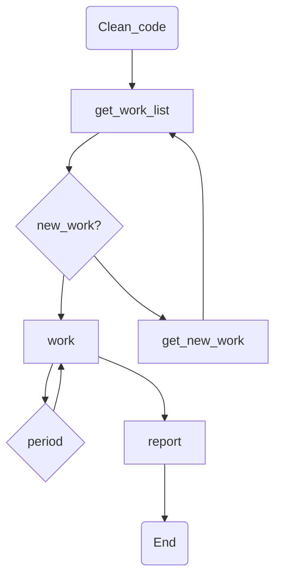

# Auto schaduler

# Auto Run
If AWS or a private server runs source code without a tiny terminal, this approach helps.

## Plan


## Clean code
- python package tarfile with file filtering

## Test report
- EDA report
  - csv table
  
```
How to create report with python
```